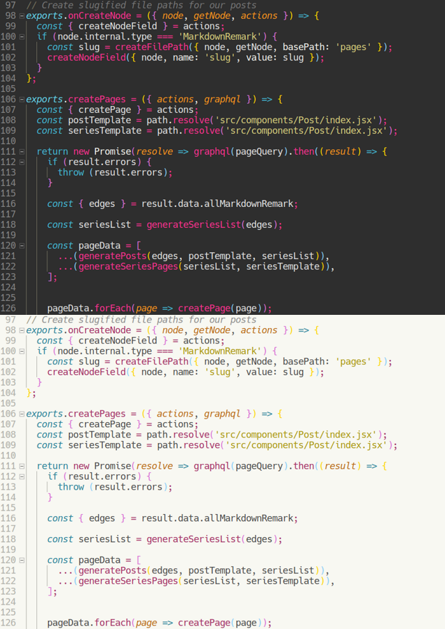

# Spaceland Monokai

Light and dark syntax themes for [Visual Studio Code][vscode]. The dark theme was adapted from [Flatland Monokai][flatland], with tweaks to lower the overall contrast and swap a few colors to match a Monokai-style theme for Notepad++ that I previously used.

[vscode]: https://code.visualstudio.com/
[flatland]: https://marketplace.visualstudio.com/items?itemName=gerane.Theme-FlatlandMonokai
